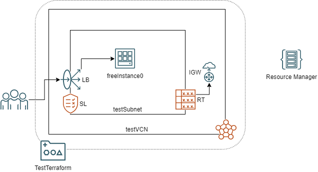

# OCI FastTrack 2022

## Ejercicio de Prueba de CLI, SDK-Python y Ansible

Ejercicios sencillos 

Ansible: Listado de namespace de tenant OCI

CLI: Informacion acerca de una instancia

SDK-Python: Listado de tags de todas las instancias.

## Ejercicio de Prueba de Terraform desde CLI y desde Resource Manager

Ejercicios adaptados de:

https://github.com/oracle/terraform-provider-oci/blob/master/examples/always_free/main.tf

y de:

http://www.brokedba.com/2020/07/terraform-for-dummies-launch-instance.html