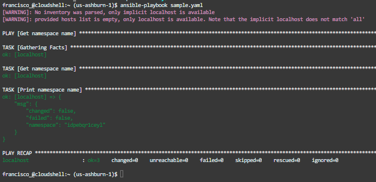

# OCI FastTrack 2022
# Ejercicio de Pruebas Sencillo para probar automatizacion en OCI
## Ansible, Python y CLI
## Terraform con y sin Resource Manager

Para todos los casos es necesario, tener una cuenta en Oracle Cloud Infrastructure. Se desea ejecutar la mayor cantidad de configuracion desde Cloud Shell, de otra manera tambien se puede ejecutar localmente. Si se realiza la configuracion local es necesario ejecutar los [pasos para instalacion y configuración CLI](https://docs.oracle.com/es-ww/iaas/Content/API/SDKDocs/cliinstall.htm)


#### Ejercicios sencillos para probar funcionalidades:

Se puede clonar el repositorio

> git clone https://github.com/fmorenod81/OCI_TF.git

y se ingresa a la carpeta

> cd OCI_TF

### Ansible: 

El archivo se llama [sample.yaml](./Ansible/sample.yaml), que muestra el nombre del namespace del tenant actual. El ansible esta instalado por defecto en el Cloud Shell, y para el computador local se siguen las [instrucciones para su instalacion](https://docs.ansible.com/ansible/latest/installation_guide/intro_installation.html)

Su ejecucion se realiza asi:
```ansible-playbook sample.yaml```

La respuesta es:




### CLI:

Se tienen diferentes [SDK](https://docs.oracle.com/en-us/iaas/Content/API/Concepts/sdks.htm) para la ejecucion de las llamadas API a OCI: Java, Python, Go, TypeScript/Javascript, .NET, Go y Ruby.

Por caracteristicas simples, se usara un Python desde una [Fuente No Oficial](https://github.com/adizohar/list_resources_in_tenancy)


Su objetivo es mostrar los tags de las instancias de computo desde una linea de comandos:

Para la ejecuciond desde el Cloud Shell, se puede realizar asi:

```python list_compute_tags_in_tenancy.py -dt```


Desde el computador local con Python ya instalado, se ejecuta asi:

```python list_compute_tags_in_tenancy.py -t Nombre_Perfil```

Aqui los parametros son opcionales (*-t Nombre_Perfil*), pero para simplicidad se usara un perfil en el archivo de configuracion OCI.


## Ejercicio de Prueba de Terraform desde CLI y desde Resource Manager


Ejercicios adaptados de:

https://github.com/oracle/terraform-provider-oci/blob/master/examples/always_free/main.tf

y de:

http://www.brokedba.com/2020/07/terraform-for-dummies-launch-instance.html