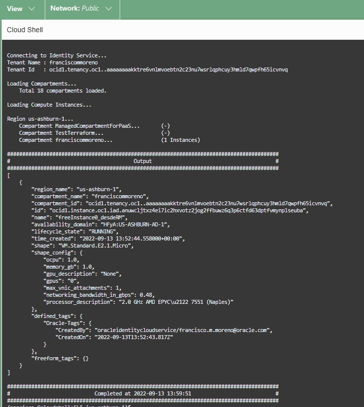
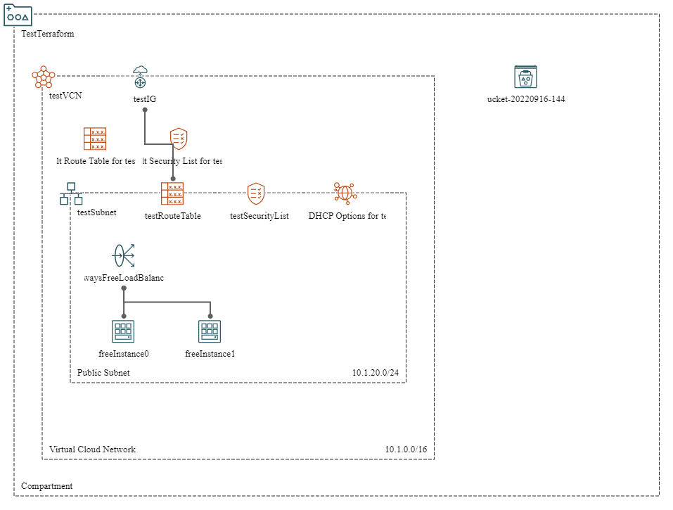
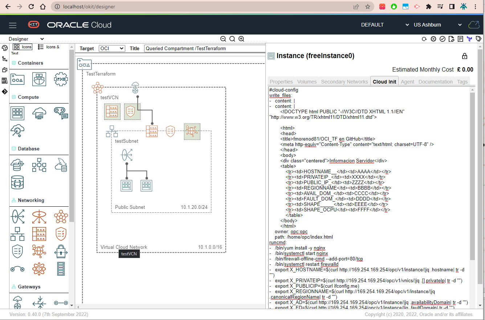

# OCI FastTrack 2022
# Ejercicio de Pruebas Sencillo para probar automatizacion en OCI
## Ansible, Python y CLI
## Terraform con y sin Resource Manager

Para todos los casos es necesario, tener una cuenta en Oracle Cloud Infrastructure. Se desea ejecutar la mayor cantidad de configuracion desde Cloud Shell, de otra manera tambien se puede ejecutar localmente. Si se realiza la configuracion local es necesario ejecutar los [pasos para instalacion y configuración CLI](https://docs.oracle.com/es-ww/iaas/Content/API/SDKDocs/cliinstall.htm)


#### Ejercicios sencillos para probar funcionalidades:

Se puede clonar el repositorio

> git clone https://github.com/fmorenod81/OCI_TF.git

y se ingresa a la carpeta

> cd OCI_TF

### Ansible: 

El archivo se llama [sample.yaml](./Ansible/sample.yaml), que muestra el nombre del namespace del tenant actual. El ansible esta instalado por defecto en el Cloud Shell, y para el computador local se siguen las [instrucciones para su instalacion](https://docs.ansible.com/ansible/latest/installation_guide/intro_installation.html)

Su ejecucion se realiza asi:
```ansible-playbook sample.yaml```

La respuesta es:


### CLI:

Se tienen diferentes [SDK](https://docs.oracle.com/en-us/iaas/Content/API/Concepts/sdks.htm) para la ejecucion de las llamadas API a OCI: Java, Python, Go, TypeScript/Javascript, .NET, Go y Ruby.

Por caracteristicas simples, se usara un Python desde una [Fuente No Oficial](https://github.com/adizohar/list_resources_in_tenancy)


Su objetivo es mostrar los tags de las instancias de computo desde una linea de comandos:

Para la ejecuciond desde el Cloud Shell, se puede realizar asi:

```python list_compute_tags_in_tenancy.py -dt```



Desde el computador local con Python ya instalado, se ejecuta asi:

```python list_compute_tags_in_tenancy.py -t Nombre_Perfil```

Aqui los parametros son opcionales (*-t Nombre_Perfil*), pero para simplicidad se usara un perfil en el archivo de configuracion OCI.


## CLI

Cuando ya se tiene instalado el OCI CLI, se pueden ejecutar scripts o solamente sentencias solas. Sugerencia es usar jq como parser para las salidas JSON y asi concatenar llamadas CLI.
Por ejemplo, invocandolo desde el Cloud Shell,

```oci iam compartment list```


o haciendo la llamada local, usando tambien un perfil preestablecido (PERSONAL).
```oci iam compartment list --profile PERSONAL```


## Terraform Local:

Para este ejercicio se usara el Terraform Local cuyo codigo esta en la carpeta [Desde_CLI](./Desde_CLI/), despues de realizar la [instalacion de Terraform](https://learn.hashicorp.com/tutorials/terraform/install-cli)

Entonces se modificara las variables adecuadas en el archivo terraform.vars que son las mismas que se usan para [configurar el OCI CLI](https://docs.oracle.com/es-ww/iaas/Content/API/SDKDocs/cliinstall.htm) y una [instancia Linux a trabes de SSH](https://docs.oracle.com/en-us/iaas/Content/GSG/Tasks/testingconnection.htm)

Se ejecutan los ciclos de:

**terraform init**
**terraform plan**
**terraform apply**

El objetivo es crear un balanceador con 2 instancias sencillas mostrando metadata de la instancia.



## Terraform Remoto:

Se comparan los archivos de Terraform Local y Remoto, antes de generar el archivo comprimido y cargarlo en Resource Manager.

Es mas sencillo este despliegue, sin embargo tiene ejecucion como CloudInit y redes.


Estos ejercicios usando Terraform, se tomaron desde [GitHub](https://github.com/oracle/terraform-provider-oci/blob/master/examples/always_free/main.tf) y desde [Blogs](http://www.brokedba.com/2020/07/terraform-for-dummies-launch-instance.html)


## OCI designer ToolKIT - OKIT

Existe diferentes maneras para ejecutarlo:

- [Tutorial en español para ejecutarlo localmente](https://www.itsimplenow.com/como-instalar-oracle-okit-designer-linux-windows/#creando-archivo-de-configuraci%C3%B3n-de-okit-y-la-llave-ssh-para-conectarnos-a-la-api-de-oci)
- [Instalacion Oficial de OKIT](https://github.com/oracle/oci-designer-toolkit/blob/master/documentation/Installation.md#install-on-oci-instance)

Pagina Oficial de [OKIT](https://github.com/oracle/oci-designer-toolkit)




francisco.m.moreno@oracle.com